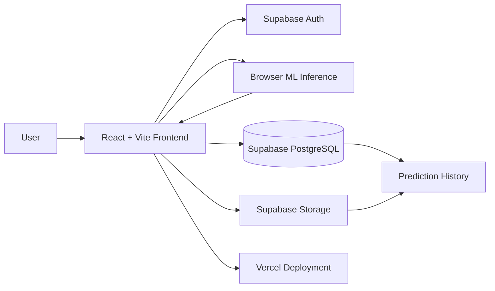
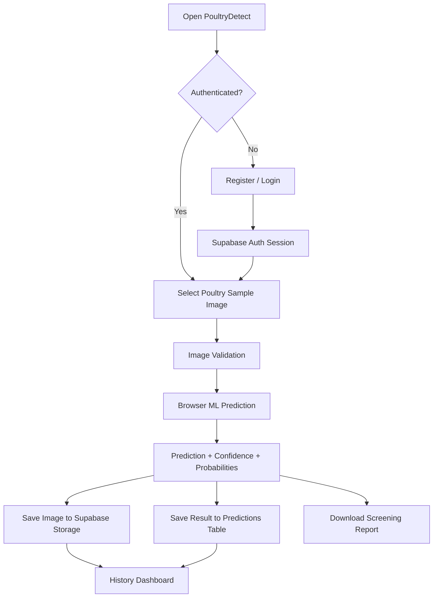

# PoultryDetect — AI Poultry Disease Classification

PoultryDetect is an academic AI-assisted web application for screening poultry fecal sample images and classifying them into four categories: **Healthy, Coccidiosis, Salmonella, and Newcastle**.

The current deployed application provides cloud authentication, image-based prediction, confidence scores, per-class probabilities, scan history, image storage, filtering, report download, and responsive UI.

> **Live application:** https://poultry-disease-classification.vercel.app

## Project Objective

The project explores how machine learning can support early poultry-health screening through image analysis. A user can create an account, upload a poultry fecal sample image, receive a predicted class with confidence information, and review previous scans.

This application is intended for **academic demonstration and screening support only**. It is not a validated veterinary diagnostic system.

## Disease Classes

| Class | Meaning in this project |
|---|---|
| **Healthy** | Sample is most similar to healthy examples in the project dataset |
| **Coccidiosis** | Visual pattern is most similar to coccidiosis examples |
| **Salmonella** | Visual pattern is most similar to Salmonella examples |
| **Newcastle** | Visual pattern is most similar to Newcastle disease examples |

## Main Features

- Secure **Register / Login / Logout** using Supabase Auth
- Persistent cloud sessions across devices
- Poultry fecal image upload with image validation
- Browser-side machine-learning inference
- Predicted disease class and confidence score
- Probability breakdown across all four classes
- Disease-specific observation, prevention, and next-step guidance
- Automatic prediction-history saving
- Private image storage in Supabase Storage
- User-specific history protected with Row Level Security (RLS)
- Advanced history dashboard with statistics and filters
- Scan details modal and delete option
- Downloadable screening report
- Responsive modern UI with AI-themed animation
- Vercel production deployment with GitHub auto-deploy

## Current Production Architecture



### Technology Stack

| Layer | Technology |
|---|---|
| Frontend | React 18, Vite, React Router |
| Authentication | Supabase Auth |
| Database | Supabase PostgreSQL |
| Image Storage | Supabase Storage |
| Security | Supabase Row Level Security |
| Deployed ML inference | Browser-side JavaScript classifier |
| Deployment | Vercel |
| Source Control | GitHub |
| Academic transfer-learning module | TensorFlow / Keras / MobileNetV2 |

## Machine-Learning Implementation

### Deployed Browser Classifier

The live application currently performs inference directly in the browser. The implementation is in:

```text
client/src/ml/browserModel.js
client/src/ml/poultryBrowserModel.json
```

For each uploaded image, the browser model:

1. Resizes the image to **40 × 40** pixels.
2. Extracts RGB and HSV statistics.
3. Computes channel histograms.
4. Computes grayscale and edge-magnitude statistics.
5. Extracts spatial block-wise RGB averages.
6. Standardizes the feature vector using stored training statistics.
7. Applies learned linear class weights.
8. Converts class scores to probabilities using **Softmax**.
9. Returns the highest-probability class as the prediction.

The current project UI reports approximately **87.4% validation accuracy** for this lightweight deployed classifier. This value should be treated as a result on the project validation dataset, not as clinical or field validation.

### Transfer-Learning Training Module

The repository also contains an academic transfer-learning pipeline:

```text
ml/training/train.py
```

That module uses **MobileNetV2 pretrained on ImageNet**, followed by Global Average Pooling, Dense and Dropout layers, then fine-tuning of the upper MobileNetV2 layers.

The training configuration in the repository includes:

- Input size: **224 × 224**
- Batch size: **32**
- Initial training epochs: **15**
- Data augmentation: rotation, shifts, horizontal flip, zoom
- Optimizer: Adam
- Loss: categorical cross-entropy
- Early stopping and best-model checkpointing
- Fine-tuning with a lower learning rate

> **Important accuracy note:** The current live web deployment uses the lightweight browser classifier. The repository's MobileNetV2 code is a separate transfer-learning training path. Do not claim that the live deployment is running MobileNetV2 unless the trained MobileNetV2 model is actually exported and connected to production inference.

## User Flow



## Supabase Data Design

### `predictions` table

Each saved scan contains:

- `id`
- `user_id`
- `predicted_class`
- `confidence`
- `probabilities` (JSON)
- `image_path`
- `created_at`

### Storage

Uploaded scan images are stored in the private bucket:

```text
prediction-images
```

Images are stored under a user-specific folder path.

### Security

Row Level Security policies restrict authenticated users to their own prediction records and image objects. A user cannot normally read or delete another user's history through the application.

## Repository Structure

```text
poultry-disease-classification/
├── client/                     # Current production React application
│   ├── src/
│   │   ├── components/         # Navbar, protected routes, AI animation
│   │   ├── ml/                 # Browser classifier and trained parameters
│   │   ├── pages/              # Home/Detect, Login, Register, History
│   │   ├── AuthContext.jsx     # Supabase session state
│   │   └── supabaseClient.js   # Supabase client configuration
│   └── package.json
├── ml/
│   ├── training/train.py       # MobileNetV2 transfer-learning training path
│   └── inference_service/      # Python inference-service reference implementation
├── server/                     # Earlier Node/Express backend architecture
└── README.md
```

The `server/` and Python inference-service folders are retained as development/reference architecture. The **current live application does not depend on them for prediction or authentication**.

## Run Locally

Requirements:

- Node.js 18+
- npm
- Modern browser with Canvas and `createImageBitmap` support

```bash
git clone https://github.com/Mithun9661/poultry-disease-classification.git
cd poultry-disease-classification/client
npm install
npm run dev
```

Open the local Vite URL shown in the terminal.

### Production Build

```bash
npm run build
npm run preview
```

## Deployment

The production frontend is deployed on **Vercel** and connected to the GitHub `main` branch. New commits automatically trigger a production deployment.

Cloud authentication, prediction records, and scan-image storage are provided through **Supabase**.

**Production URL:** https://poultry-disease-classification.vercel.app

## End-to-End Functional Flow

The implemented project flow is:

```text
Register
   ↓
Login / Cloud Session
   ↓
Upload Poultry Sample Image
   ↓
ML Feature Extraction + Classification
   ↓
Predicted Class + Confidence + Probabilities
   ↓
Guidance + Downloadable Report
   ↓
Supabase Database + Private Image Storage
   ↓
History Dashboard / Filter / View / Delete
```

## Validation and Testing

The application has been checked for the main production flows:

- Direct route loading on Vercel
- Registration and login
- Persistent authentication session
- Protected detector and history routes
- JPG/PNG image upload
- Maximum image-size validation
- Four-class prediction output
- Confidence and probability display
- Prediction-record insertion
- Private scan-image upload
- History retrieval
- Signed image access
- User-specific RLS policies
- History deletion
- Responsive layouts

## Limitations

- The deployed lightweight classifier is intended for academic demonstration.
- Accuracy measured on a project validation split does not guarantee performance on images from different farms, cameras, lighting conditions, ages, breeds, or geographic regions.
- Fecal-image appearance alone may not be sufficient to diagnose many poultry diseases.
- Similar visual patterns can occur across different diseases or non-disease conditions.
- Veterinary examination and laboratory testing may be required for real diagnosis.
- The MobileNetV2 transfer-learning pipeline in `ml/` is not currently the model serving the live web application.

## Future Improvements

- Train and evaluate the MobileNetV2 transfer-learning model on a clearly documented train/validation/test split
- Add confusion matrix, precision, recall, F1-score, and per-class evaluation
- Export the final deep-learning model to TensorFlow.js or deploy a dedicated ML inference API
- Compare MobileNetV2 with EfficientNet, ResNet, or other transfer-learning architectures
- Add stronger image-quality and out-of-distribution detection
- Add veterinarian-reviewed disease guidance
- Add multilingual support for farmers
- Add farm/flock-level monitoring and analytics

## Academic Disclaimer

**PoultryDetect is an academic screening project and is not a medical or veterinary diagnostic device.** Predictions and confidence values should not be used as the sole basis for treatment, culling, vaccination, medication, or other flock-management decisions. Consult a qualified poultry veterinarian for diagnosis and treatment.

## Author

**Mithun Kumar**  
B.Tech — Computer Science & Engineering (Artificial Intelligence & Machine Learning)
