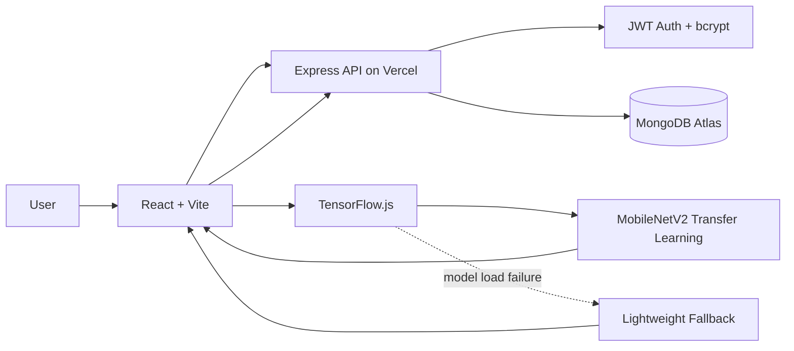
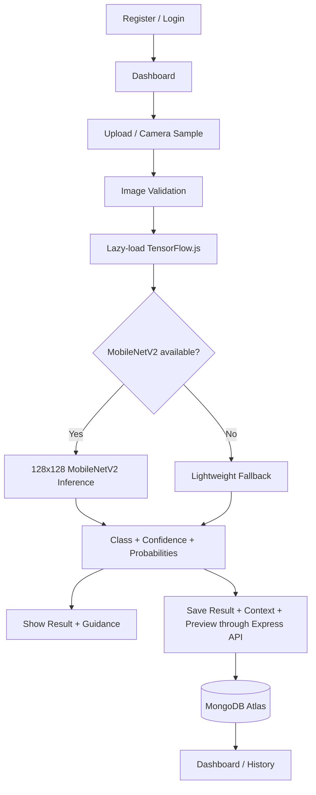

# PoultryDetect — AI Poultry Disease Classification

PoultryDetect is an academic AI-assisted web application for screening poultry sample images and classifying them into four classes: **Healthy, Coccidiosis, Salmonella, and Newcastle**.

> **Live app:** https://poultry-disease-classification.vercel.app
>
> **API health:** https://poultry-disease-classification.vercel.app/api/health
>
> **Safety:** This is an academic screening aid, not a veterinary diagnostic system.

## Production Features

- MongoDB Atlas account registration and login
- bcrypt password hashing + JWT-protected API access
- persistent dashboard and per-user prediction history
- upload, drag/drop, or mobile camera capture
- JPG/PNG and image-size validation
- optional flock symptoms and environment context
- **MobileNetV2 transfer-learning inference** through TensorFlow.js
- lightweight browser classifier fallback if the transfer model cannot load
- confidence, four-class probability output, model name/version and inference time
- disease information, prevention guidance and recommended next step
- compressed scan preview stored with prediction history
- history search/filter/details/delete
- downloadable screening report
- responsive dashboard, detector, auth and history UI
- Vercel production deployment
- automated frontend, backend and ML-contract checks

## Production Architecture



### Stack

| Layer | Technology |
|---|---|
| Frontend | React 18, Vite, React Router |
| Primary inference | MobileNetV2 Transfer Learning + TensorFlow.js |
| Fallback inference | Handcrafted-feature multiclass classifier |
| Backend | Node.js + Express |
| Authentication | bcrypt + signed JWT |
| Database | MongoDB Atlas + Mongoose |
| Hosting | Vercel |
| CI | GitHub Actions |

Supabase was used during an earlier project stage. The final production application no longer depends on Supabase at runtime. Legacy scan records were moved to a MongoDB migration queue and are claimed by matching-email MongoDB accounts.

## Disease Classes

| Class | Meaning in this project |
|---|---|
| Healthy | Image is most similar to healthy examples |
| Coccidiosis | Visual pattern is most similar to coccidiosis examples |
| Salmonella | Visual pattern is most similar to Salmonella examples |
| Newcastle | Visual pattern is most similar to Newcastle-disease examples |

## ML Runtime

The primary browser model is an attributed **MobileNetV2 transfer-learning checkpoint** converted to TensorFlow.js.

```text
client/src/ml/browserModel.js
client/src/ml/transferModel.js
client/src/ml/lightweightModel.js
client/public/models/mobilenetv2/model.json
client/public/models/mobilenetv2/group1-shard*.bin
```

### MobileNetV2 contract

- RGB input
- shape: **128 × 128 × 3**
- normalization: **[0, 1]**
- output: **4-class Softmax**
- class order: Coccidiosis, Healthy, Newcastle, Salmonella
- browser runtime: TensorFlow.js

TensorFlow.js is lazy-loaded only when a scan is run.

### Model provenance and metrics

The production transfer-learning checkpoint is an attributed reference checkpoint from the MIT-licensed upstream repository:

```text
Saeed-dev2/poultry_Form_Disease_Deep-Learning-Machine-Learning-Computer-vision
```

PoultryDetect does **not** claim that this exact checkpoint was trained inside this repository. Provenance and upstream license files are preserved under `client/public/models/mobilenetv2/`.

The upstream project reports approximately **90% validation accuracy** and **93% test accuracy** for its selected MobileNetV2 model. Those numbers are upstream-reported, not a new independent PoultryDetect evaluation.

The fallback classifier was independently evaluated on the project subset at approximately **87.4% validation accuracy**. This number must not be presented as MobileNetV2 accuracy.

See `docs/MODEL_CARD.md` and `docs/VALIDATION_AND_TESTING.md` for the interpretation rules.

## Prediction Flow



## MongoDB Data Design

### `users`

```text
name
email
password (bcrypt hash; excluded from normal queries)
createdAt
updatedAt
```

### `predictions`

```text
user
predictedClass
confidence
allProbabilities
imageUrl (compressed preview data URI)
reportedSymptoms
environment
modelName
modelVersion
inferenceMs
treatmentSuggestion
source
createdAt
updatedAt
```

A legacy migration queue preserves old Supabase prediction metadata until a matching MongoDB account is available.

## API

```text
GET    /api/health
POST   /api/auth/register
POST   /api/auth/login
GET    /api/auth/me
GET    /api/history
POST   /api/history
DELETE /api/history/:id
POST   /api/predict
```

Protected endpoints require a valid Bearer JWT. History queries and deletes are always scoped to the authenticated user.

## Security Controls

- bcrypt password hashing
- JWT verification pinned to HS256
- password field excluded from normal Mongoose queries
- authentication rate limiting
- general API rate limiting
- Helmet security headers
- explicit production CORS allowlist
- JSON body-size limits
- email/password/name validation
- prediction-class, probability, symptom and environment validation
- per-user history authorization
- Vercel browser security headers
- repository-wide `.gitignore` for `.env` and generated artifacts

Production secrets must remain in deployment environment variables and must never be committed to GitHub.

## Environment Variables

Use `server/.env.example` as the template:

```env
PORT=5000
MONGO_URI=mongodb+srv://<username>:<password>@<cluster>/<database>
JWT_SECRET=<long-random-secret>
CORS_ORIGIN=http://localhost:5173,https://poultry-disease-classification.vercel.app
ML_SERVICE_URL=http://localhost:8000
```

## Local Development

```bash
git clone https://github.com/Mithun9661/poultry-disease-classification.git
cd poultry-disease-classification
```

Backend:

```bash
cd server
npm install
cp .env.example .env
npm run dev
```

Frontend:

```bash
cd client
npm install
npm run dev
```

The Vite development server proxies `/api` to `http://localhost:5000`.

## Automated Testing

`.github/workflows/quality_checks.yml` runs:

1. React/Vite production build
2. Express + MongoDB in-memory smoke test
3. authentication validation and unauthorized-access checks
4. prediction-history create/read/delete and cross-user isolation checks
5. MobileNetV2 TensorFlow.js model-contract verification
6. Python evaluation-script syntax validation

The backend smoke test covers the full core API sequence: health → register → login → session → protected history → create/read/delete → user isolation.

## Reproducible Model Evaluation

`ml/evaluation/evaluate_mobilenet.py` can evaluate the declared Keras checkpoint against a declared validation/test split and generate accuracy, precision, recall, F1, per-class metrics and a confusion matrix.

```bash
python ml/evaluation/evaluate_mobilenet.py \
  --model mobilenetv2.h5 \
  --split-dir organized_dataset/val \
  --output-dir ml/evaluation/results
```

## Repository Structure

```text
poultry-disease-classification/
├── .github/workflows/
├── api/                         # Vercel Express function entry
├── client/
│   ├── public/models/mobilenetv2/
│   └── src/
│       ├── apiClient.js
│       ├── components/
│       ├── ml/
│       └── pages/
├── docs/
├── ml/
│   ├── evaluation/
│   ├── inference_service/
│   └── training/
├── server/
│   ├── config/
│   ├── middleware/
│   ├── models/
│   ├── routes/
│   ├── app.js
│   ├── server.js
│   └── smoke_test.js
└── vercel.json
```

## Known Limitations

- The model is an academic screening model and is not clinically validated.
- Confidence is a model probability output, not a guarantee of correctness.
- Images unlike the training domain may be unreliable.
- Symptoms/environment are stored as supporting context; they do not currently modify the image-model score.
- The production MobileNetV2 checkpoint is attributed upstream rather than trained inside this repository.

## Documentation

- [System Architecture](docs/ARCHITECTURE.md)
- [Model Card](docs/MODEL_CARD.md)
- [Validation and Testing](docs/VALIDATION_AND_TESTING.md)
- [Viva Guide](docs/VIVA_GUIDE.md)

## Disclaimer

PoultryDetect outputs are academic screening predictions. They are not a substitute for veterinary examination, laboratory confirmation, or professional treatment advice.
