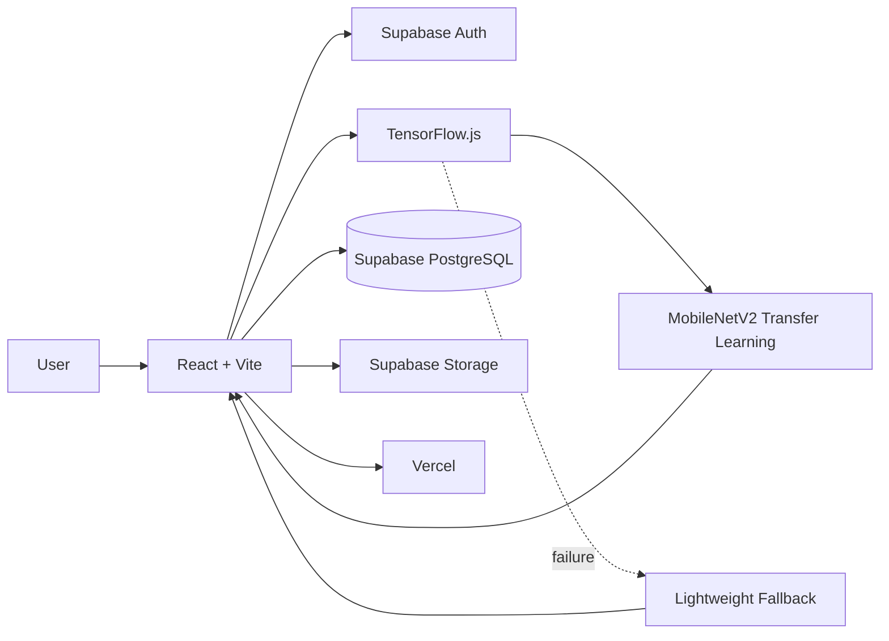
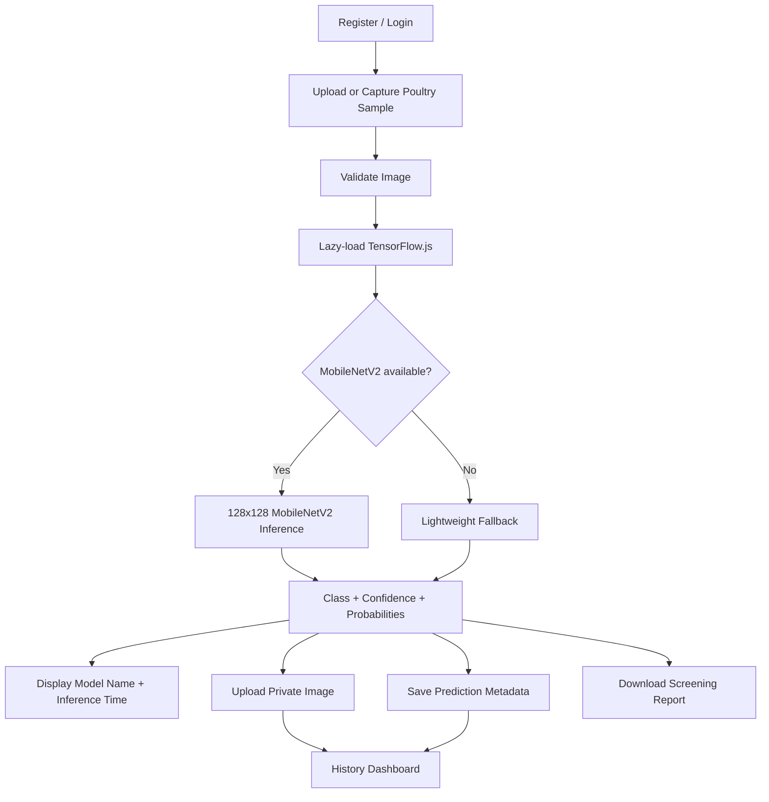

# PoultryDetect — AI Poultry Disease Classification

PoultryDetect is an academic AI-assisted web application for screening poultry fecal sample images and classifying them into four categories: **Healthy, Coccidiosis, Salmonella, and Newcastle**.

The live application provides cloud authentication, MobileNetV2 transfer-learning inference, confidence scores, per-class probabilities, symptom/environment context, private scan history, report download, and a responsive browser UI.

> **Live application:** https://poultry-disease-classification.vercel.app

> **Safety:** This is an academic screening aid, not a veterinary diagnostic system.

## Main Features

- Register / Login / Logout using Supabase Auth
- Persistent authenticated sessions
- Poultry fecal image upload or camera capture
- JPG/PNG and file-size validation
- Basic image-quality warnings
- **MobileNetV2 Transfer Learning** inference through TensorFlow.js
- Lightweight browser classifier fallback if the deep-learning model cannot load
- Four-class probability output and confidence score
- Model name/version and inference-time display
- Optional observed symptoms and farm-environment context
- Disease information, prevention guidance and recommended next step
- Private prediction image storage
- User-specific scan history protected by Supabase RLS
- History search/filter/details/delete
- Downloadable screening report
- Responsive AI-themed interface
- Vercel production deployment
- Node/Express/MongoDB reference backend with automated smoke tests
- GitHub Actions quality checks

## Production Architecture



### Production Technology Stack

| Layer | Technology |
|---|---|
| Frontend | React 18, Vite, React Router |
| Primary ML inference | MobileNetV2 Transfer Learning + TensorFlow.js |
| Fallback ML | Lightweight handcrafted-feature browser classifier |
| Authentication | Supabase Auth |
| Production database | Supabase PostgreSQL |
| Image storage | Supabase Storage |
| Data security | Supabase Row Level Security |
| Deployment | Vercel |
| Source control / CI | GitHub + GitHub Actions |

## Disease Classes

| Class | Project meaning |
|---|---|
| Healthy | Image is most similar to healthy training examples |
| Coccidiosis | Visual pattern is most similar to coccidiosis examples |
| Salmonella | Visual pattern is most similar to Salmonella examples |
| Newcastle | Visual pattern is most similar to Newcastle-disease examples |

## Production Machine-Learning Model

The live detector now uses an attributed **MobileNetV2 transfer-learning checkpoint** as the primary model.

Important runtime files:

```text
client/src/ml/browserModel.js
client/src/ml/transferModel.js
client/src/ml/lightweightModel.js
client/public/models/mobilenetv2/model.json
client/public/models/mobilenetv2/group1-shard*.bin
```

### MobileNetV2 inference contract

- Input: RGB image
- Input shape: **128 × 128 × 3**
- Normalization: pixels scaled to **[0, 1]**
- Output: **4-class Softmax**
- Class order: Coccidiosis, Healthy, Newcastle, Salmonella
- Runtime: TensorFlow.js in the browser

TensorFlow.js is loaded dynamically only when a scan needs the deep-learning model. This keeps the normal application bundle much smaller than bundling the full ML runtime into every initial page load.

### Model provenance

The production MobileNetV2 checkpoint is an **attributed reference checkpoint** from the MIT-licensed upstream repository:

```text
Saeed-dev2/poultry_Form_Disease_Deep-Learning-Machine-Learning-Computer-vision
```

PoultryDetect does **not** claim that this exact production checkpoint was trained inside this repository.

Provenance and license files:

```text
client/public/models/mobilenetv2/PROVENANCE.txt
client/public/models/mobilenetv2/LICENSE-UPSTREAM.txt
```

Conversion workflow:

```text
.github/workflows/prepare_transfer_model.yml
```

The upstream project reports approximately **90% validation accuracy** and **93% test accuracy** for its selected MobileNetV2 Transfer Learning model. These are upstream-reported results, not a new independent PoultryDetect evaluation.

See [docs/MODEL_CARD.md](docs/MODEL_CARD.md) and [docs/VALIDATION_AND_TESTING.md](docs/VALIDATION_AND_TESTING.md) for the exact interpretation rules.

## Lightweight Fallback Model

If TensorFlow.js or the MobileNetV2 asset cannot load, the detector automatically uses its earlier lightweight classifier.

```text
client/src/ml/lightweightModel.js
client/src/ml/poultryBrowserModel.json
```

The fallback model uses RGB/HSV statistics, histograms, grayscale/gradient features and spatial RGB features with a learned multiclass linear classifier.

An independent validation experiment on the project subset produced approximately **87.4% accuracy** for this fallback classifier. This figure must not be presented as MobileNetV2 accuracy.

## Reproducible Model Evaluation

The repository includes an evaluation utility for the exact Keras MobileNetV2 checkpoint:

```text
ml/evaluation/evaluate_mobilenet.py
```

It produces accuracy, precision, recall, F1, per-class metrics and confusion-matrix files for a declared validation/test directory.

Example:

```bash
python ml/evaluation/evaluate_mobilenet.py \
  --model mobilenetv2.h5 \
  --split-dir organized_dataset/val \
  --output-dir ml/evaluation/results
```

## Prediction Flow



## Supabase Data Design

The production `predictions` table stores fields such as:

```text
id
user_id
predicted_class
confidence
probabilities
image_path
reported_symptoms
environment
model_name
model_version
inference_ms
created_at
```

Uploaded images are stored in the private bucket:

```text
prediction-images
```

Row Level Security and user-specific storage paths restrict authenticated users to their own records and image objects.

## Node / Express / MongoDB Backend

A complete MERN-compatible backend implementation is available under:

```text
server/
```

It includes:

- Express API
- Mongoose MongoDB connection
- JWT registration/login
- authenticated prediction-history create/read/delete APIs
- symptoms/environment/model metadata fields
- optional external ML-service endpoint
- JPG/PNG upload validation
- configurable CORS
- `mongodb-memory-server` smoke tests

API endpoints:

```text
GET    /api/health
POST   /api/auth/register
POST   /api/auth/login
GET    /api/history
POST   /api/history
DELETE /api/history/:id
POST   /api/predict
```

Run the backend test:

```bash
cd server
npm install
npm test
```

The current public site still uses Supabase as its operational cloud auth/database layer. The MongoDB backend becomes a live persistent deployment only when a real production `MONGO_URI` is configured; the repository does not fake a MongoDB production connection.

## Automated Quality Checks

GitHub Actions workflow:

```text
.github/workflows/quality_checks.yml
```

It checks:

1. React/Vite production build
2. Express + MongoDB authenticated smoke test
3. MobileNetV2 TensorFlow.js model contract
4. Python evaluation-script syntax

The ML contract verifies a 128×128×3 input, four Softmax outputs, model shards, provenance and license files.

## Repository Structure

```text
poultry-disease-classification/
├── .github/workflows/
│   ├── prepare_transfer_model.yml
│   └── quality_checks.yml
├── client/
│   ├── public/models/mobilenetv2/
│   └── src/
│       ├── components/
│       ├── ml/
│       ├── pages/
│       ├── AuthContext.jsx
│       └── supabaseClient.js
├── docs/
│   ├── ARCHITECTURE.md
│   ├── MODEL_CARD.md
│   ├── VALIDATION_AND_TESTING.md
│   └── VIVA_GUIDE.md
├── ml/
│   ├── evaluation/evaluate_mobilenet.py
│   ├── training/
│   └── inference_service/
├── server/
│   ├── config/
│   ├── middleware/
│   ├── models/
│   ├── routes/
│   ├── app.js
│   ├── server.js
│   └── smoke_test.js
└── vercel.json
```

## Run the Production Frontend Locally

Requirements: Node.js 18+ and a modern browser.

```bash
git clone https://github.com/Mithun9661/poultry-disease-classification.git
cd poultry-disease-classification/client
npm install
npm run dev
```

Production build:

```bash
npm run build
npm run preview
```

## Documentation

- [System Architecture](docs/ARCHITECTURE.md)
- [Model Card](docs/MODEL_CARD.md)
- [Validation and Testing](docs/VALIDATION_AND_TESTING.md)
- [Viva Guide](docs/VIVA_GUIDE.md)

## Disclaimer

PoultryDetect outputs are academic screening predictions. They are not a substitute for veterinary examination, laboratory confirmation, or professional treatment advice.
