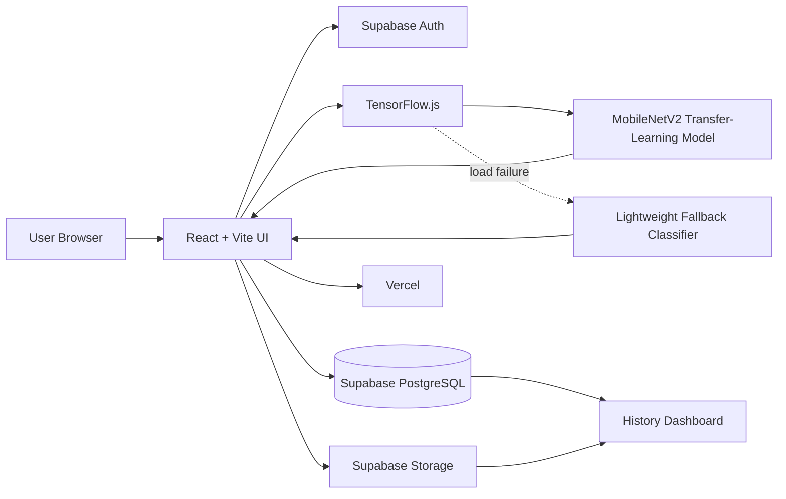
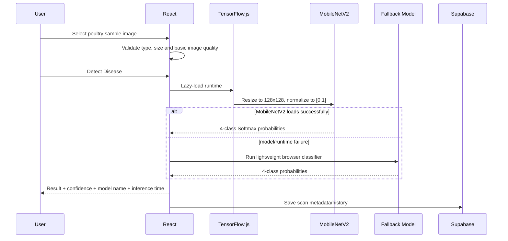

# PoultryDetect — System Architecture

## 1. Current Production Architecture

The live application is browser-first and uses MobileNetV2 transfer learning for primary inference:



The production site is available at:

```text
https://poultry-disease-classification.vercel.app
```

## 2. React Frontend

Responsibilities:

- registration/login UI and protected routes
- image upload, preview and validation
- optional flock symptoms and farm-environment context
- MobileNetV2 TensorFlow.js inference
- fallback inference when MobileNetV2 cannot load
- prediction confidence and class-probability visualization
- disease information and next-step guidance
- downloadable screening report
- scan history, filtering and deletion

## 3. Production ML Layer

Primary files:

```text
client/src/ml/browserModel.js        # MobileNetV2-first orchestrator
client/src/ml/transferModel.js       # TensorFlow.js MobileNetV2 inference
client/src/ml/lightweightModel.js    # fallback classifier
client/public/models/mobilenetv2/    # converted model assets
```

Prediction sequence:



## 4. Production Data and Authentication

### Supabase Auth

Handles:

- account registration
- login/logout
- persistent sessions
- user identity

### Supabase PostgreSQL

The production `predictions` table stores fields including:

```text
id
user_id
predicted_class
confidence
probabilities
image_path
reported_symptoms
environment
model_name
model_version
inference_ms
created_at
```

### Supabase Storage

Private bucket:

```text
prediction-images
```

User-specific storage paths plus Row Level Security keep prediction data isolated by account. History images are rendered using time-limited signed URLs.

## 5. Node/Express + MongoDB Backend

The repository also contains a complete Node/Express/MongoDB backend implementation under:

```text
server/
```

It is retained as the project's MERN-compatible backend path and now includes:

- MongoDB connection management with Mongoose
- JWT registration/login
- authenticated prediction history APIs
- create/read/delete history lifecycle
- model name/version/inference-time fields
- symptoms and environment fields matching the live UI
- optional external ML-service prediction endpoint
- image upload validation
- configurable CORS
- automated MongoDB smoke testing with `mongodb-memory-server`

API surface:

```text
GET    /api/health
POST   /api/auth/register
POST   /api/auth/login
GET    /api/history
POST   /api/history
DELETE /api/history/:id
POST   /api/predict
```

The MongoDB backend is **code-complete and CI-testable**, but the current public Vercel application continues to use Supabase for operational cloud auth/history because no production MongoDB Atlas connection URI is stored in this repository or deployment configuration.

This distinction is deliberate: the project does not claim that MongoDB is the live production database until a real `MONGO_URI` is configured.

## 6. Backend Smoke-Test Architecture

The backend test starts an isolated temporary MongoDB instance and verifies:

```text
Health endpoint
   ↓
Register user
   ↓
Login and receive JWT
   ↓
Create prediction-history record
   ↓
Read history
   ↓
Verify model metadata
   ↓
Delete history record
   ↓
Confirm history is empty
```

Run locally:

```bash
cd server
npm install
npm test
```

## 7. CI Quality Gates

GitHub Actions workflow:

```text
.github/workflows/quality_checks.yml
```

Checks:

1. React/Vite production build
2. Express + MongoDB smoke test
3. MobileNetV2 TensorFlow.js model contract
4. Python evaluation-script syntax

The model-contract job verifies that the production web model has a 128×128×3 input, four output units, Softmax activation, non-empty weight shards, provenance and upstream license files.

## 8. Model Evaluation Path

Reproducible evaluator:

```text
ml/evaluation/evaluate_mobilenet.py
```

It can generate accuracy, precision, recall, F1, per-class metrics and confusion matrix outputs from a declared validation/test directory.

See:

```text
docs/MODEL_CARD.md
```
