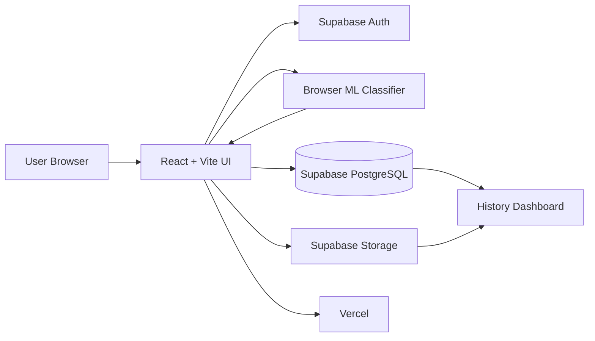
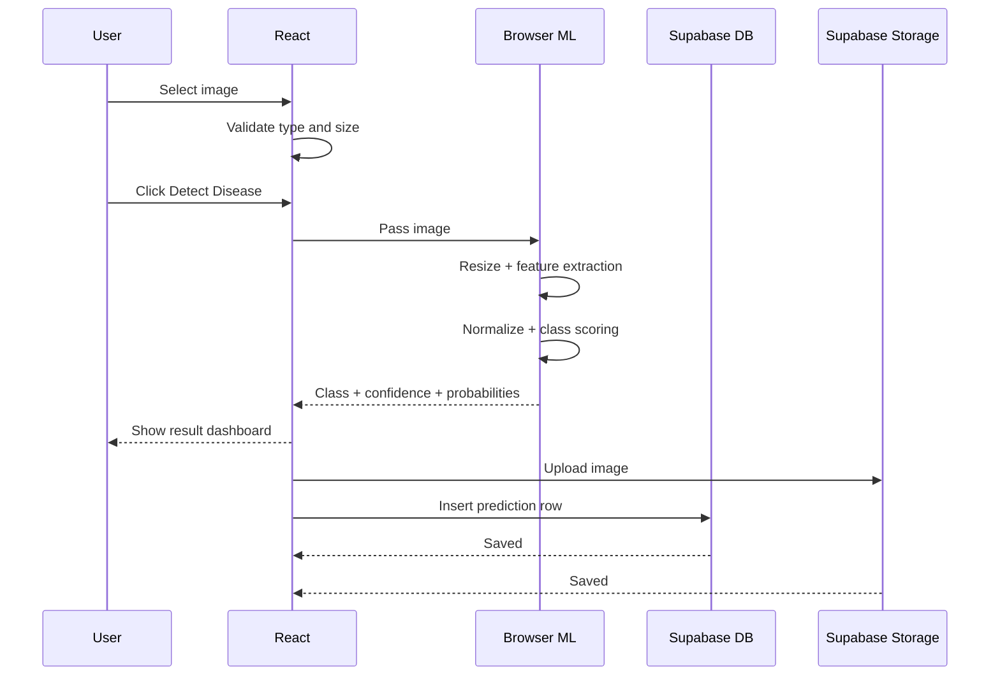
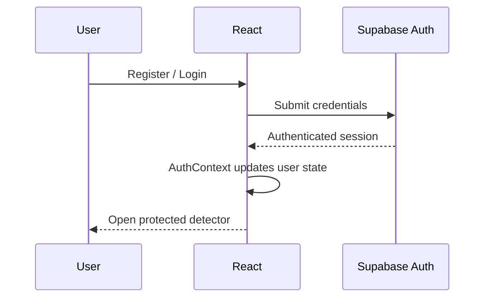

# PoultryDetect — System Architecture

## 1. Production Architecture

The current production application uses a browser-first architecture:



The current deployed application does **not** require the older Node/Express server or FastAPI inference service for its main user flow.

## 2. Main Components

### React Frontend

Responsibilities:

- route navigation
- authentication UI
- protected routes
- image upload and preview
- image validation
- browser-side ML inference
- result visualization
- report generation
- scan-history UI
- history filtering and deletion

### Supabase Auth

Responsibilities:

- account registration
- login/logout
- persistent sessions
- user identity
- cross-device account access

### Browser ML Layer

Files:

```text
client/src/ml/browserModel.js
client/src/ml/poultryBrowserModel.json
```

The model executes inside the user's browser and returns:

- predicted class
- confidence
- probability distribution for all classes

### Supabase PostgreSQL

The `predictions` table stores scan metadata and model output.

Main fields:

```text
id
user_id
predicted_class
confidence
probabilities
image_path
created_at
```

### Supabase Storage

Bucket:

```text
prediction-images
```

Each image is stored using a user-specific path so access rules can isolate files by account.

### Vercel

Vercel hosts the production React/Vite build and deploys new commits from the GitHub `main` branch.

## 3. Prediction Sequence



## 4. Authentication Sequence



## 5. Security Design

Security is primarily enforced using Supabase authentication and Row Level Security.

The application uses policies so authenticated users can operate only on prediction rows and image objects associated with their own user ID.

The image bucket is private. History images are displayed using time-limited signed URLs rather than a permanently public object URL.

## 6. Repository Architecture vs Live Architecture

The repository contains three historical/experimental layers:

```text
client/   -> active production frontend
server/   -> earlier Node/Express backend design
ml/       -> Python transfer-learning and inference-service code
```

For the current live application:

```text
React + Browser ML + Supabase + Vercel
```

For a future full deep-learning deployment:

```text
React -> ML API / TensorFlow.js -> trained MobileNetV2 model
```

## 7. Deployment URL

Production:

https://poultry-disease-classification.vercel.app
