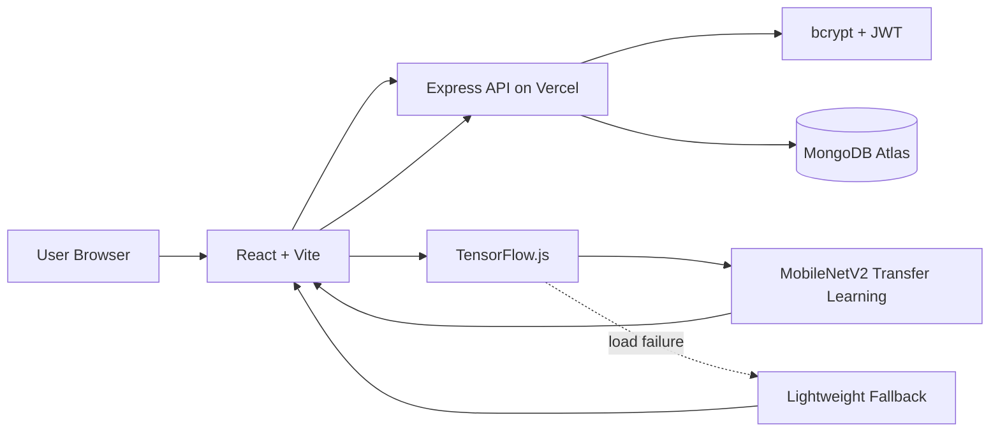
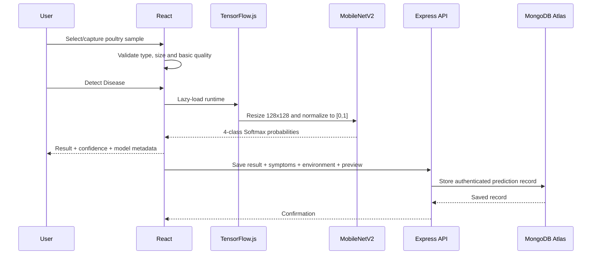

# PoultryDetect — System Architecture

## 1. Current Production Architecture



Production URL:

```text
https://poultry-disease-classification.vercel.app
```

API health:

```text
https://poultry-disease-classification.vercel.app/api/health
```

## 2. React Frontend

Responsibilities:

- registration/login UI and protected routes
- dashboard and user navigation
- image upload, camera capture, preview and validation
- optional flock symptoms and farm-environment context
- MobileNetV2 TensorFlow.js inference
- fallback inference if MobileNetV2 cannot load
- prediction confidence and class-probability visualization
- disease guidance and downloadable report
- authenticated history search/filter/details/delete

The frontend communicates with the backend through same-origin `/api/*` requests.

## 3. Production ML Layer

```text
client/src/ml/browserModel.js        # MobileNetV2-first orchestrator
client/src/ml/transferModel.js       # TensorFlow.js MobileNetV2 inference
client/src/ml/lightweightModel.js    # fallback classifier
client/public/models/mobilenetv2/    # converted model assets
```

Prediction sequence:



If the transfer model cannot load, `browserModel.js` uses the lightweight fallback and marks the result accordingly.

## 4. Authentication and Data Layer

### Authentication

The live application uses:

- Express authentication endpoints
- bcrypt password hashing
- signed JWT access tokens
- authenticated `/api/auth/me` session verification

Passwords are stored only as bcrypt hashes and are excluded from normal Mongoose queries.

### MongoDB Atlas

Primary collections include:

```text
users
predictions
disease_info
legacy_predictions
```

Each prediction references its owner. History reads and deletes always include the authenticated MongoDB user ID in the query, preventing one account from operating on another account's records.

`predictions` stores class/confidence/probabilities, model metadata, symptoms, environment and a compressed image preview.

### Legacy migration

Earlier versions used Supabase. Old prediction metadata was copied to `legacy_predictions`. When an account with the matching email registers/logs in, those records are idempotently claimed into the MongoDB `predictions` collection. Supabase is no longer a runtime dependency of the final frontend.

## 5. Express API

```text
GET    /api/health
POST   /api/auth/register
POST   /api/auth/login
GET    /api/auth/me
GET    /api/history
POST   /api/history
DELETE /api/history/:id
POST   /api/predict
```

The API is exposed through `api/index.js` as a Vercel Function and connects to MongoDB Atlas using `MONGO_URI`.

## 6. Security Controls

- bcrypt password hashing
- HS256 JWT verification
- password exclusion from normal queries
- auth-specific and general API rate limiting
- Helmet response headers
- explicit CORS allowlist
- JSON/body-size limits
- auth input validation
- prediction payload validation
- user-scoped history queries/deletes
- static browser security headers in `vercel.json`
- deployment secrets stored in environment variables, not GitHub

## 7. Backend Smoke-Test Architecture

`server/smoke_test.js` launches a temporary MongoDB instance and verifies:

```text
Health
  ↓
Unauthorized history is rejected
  ↓
Invalid registration is rejected
  ↓
Register
  ↓
Duplicate registration is rejected
  ↓
Wrong-password login is rejected
  ↓
Login + JWT
  ↓
Session verification
  ↓
Create/read prediction history
  ↓
Second user cannot delete first user's record
  ↓
Owner deletes record
```

## 8. CI Quality Gates

`.github/workflows/quality_checks.yml` verifies:

1. React/Vite production build
2. Express + MongoDB security/CRUD smoke test
3. MobileNetV2 TensorFlow.js model contract
4. Python evaluator syntax

The ML contract verifies a 128×128×3 input, four Softmax outputs, model shards, provenance and upstream license files.

## 9. Model Evaluation Path

`ml/evaluation/evaluate_mobilenet.py` can generate accuracy, precision, recall, F1, per-class metrics and a confusion matrix from a declared dataset split.

See `docs/MODEL_CARD.md` and `docs/VALIDATION_AND_TESTING.md` for metric interpretation and limitations.
